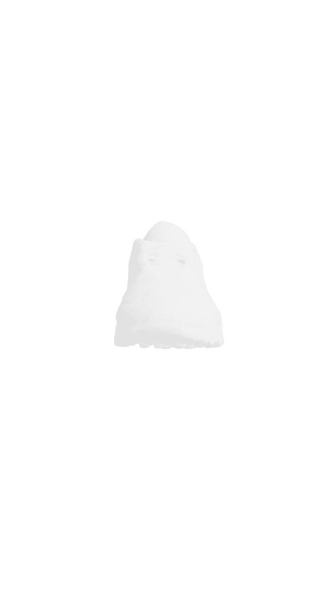
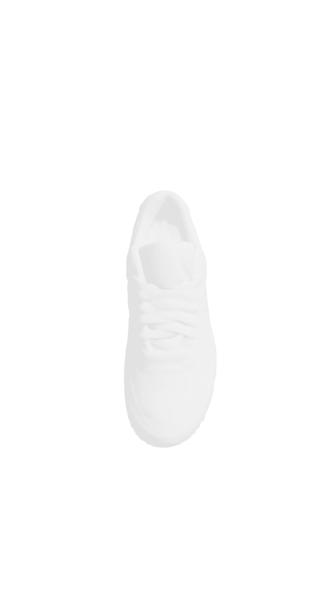
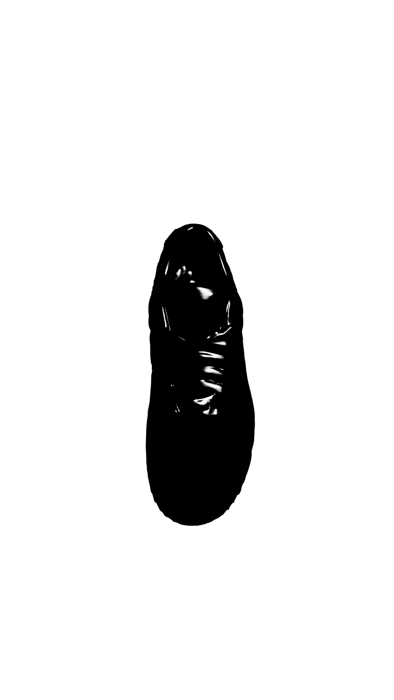
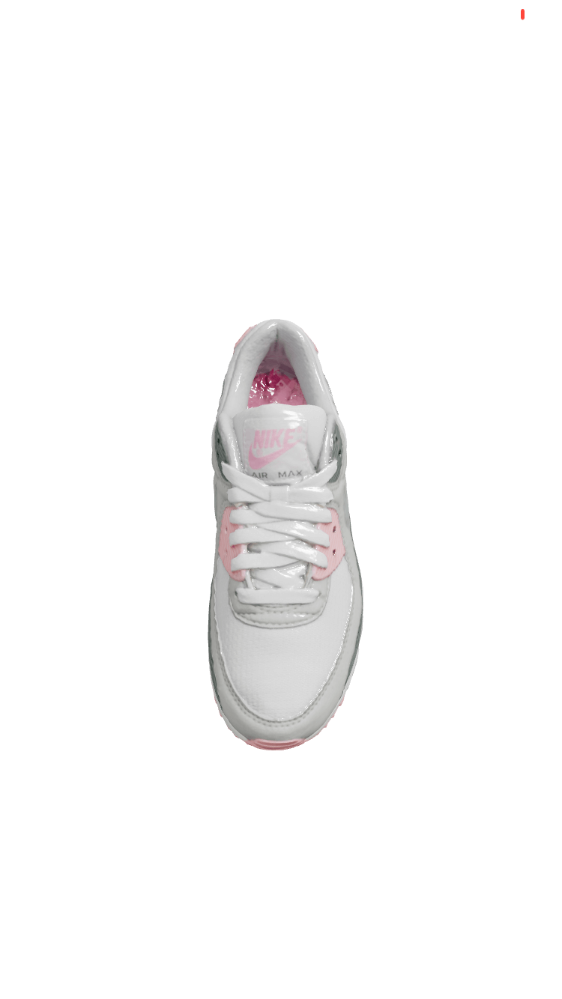
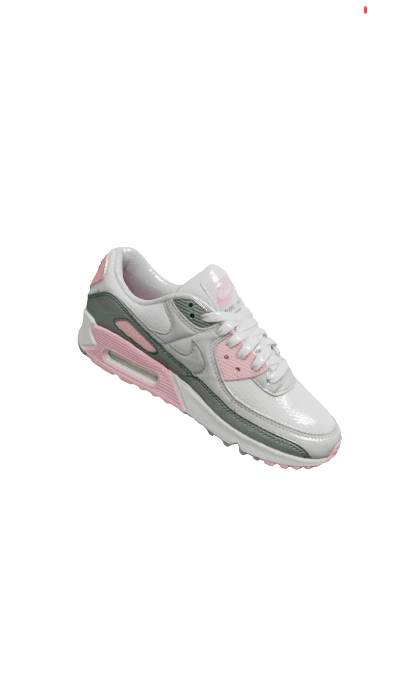
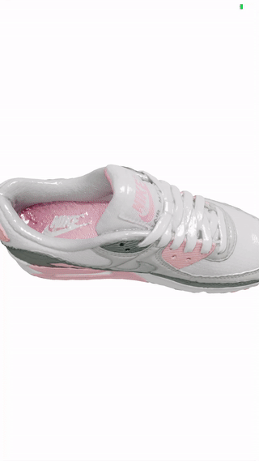

# Three Fiber 3D Animated Model With Gesture and Gyro

## React Native | Gesture handler | GYROSCOPE | Three.js | expo-gl | React-three-fiber

# steps

1. add three to the project with

```
npx expo install three @react-three/fiber expo-gl expo-three expo-file-system
```

2. add the Airmax folder to the directly in asserts

3. create or update metro.config.js

```
// metro.config.js
module.exports = {
  resolver: {
    sourceExts: ['js', 'jsx', 'json', 'ts', 'tsx', 'cjs'],
    assetExts: ['glb', 'gltf', 'mtl', 'obj', 'png', 'jpg'],
  },
}
```

4. Let’s install Reanimated library that will power our sensor based animation.
   ```
   npx expo install react-native-reanimated
   or
   yarn add react-native-reanimated
   ```

## preview

| Start                        | Second                       | End Video                    |
| ---------------------------- | ---------------------------- | ---------------------------- |
|  |  |  |
|  |  |  |
